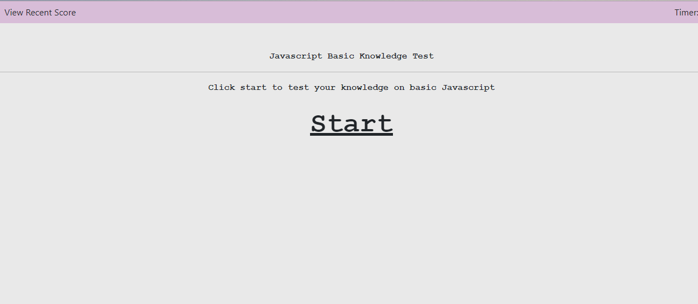

# CodeQuiz
----------------------
## Description

Application will prompt a series of questions and save your score afterward.

## Prerequisites

None

## Technologies Used

- HTML
- CSS
- Javascript


## Website Appearance




## Deployed Link
https://weilibryan.github.io/Coding-Quiz/

## Code Snippet
```
    for (var i=0; i < 4; i++) {
        
        // Row div
        var gridRow = document.createElement("div");
        gridRow.setAttribute("class", "row mx-auto");

        // Column div
        var gridColumn = document.createElement("div");
        gridColumn.setAttribute("class", "col-xs-1 text-center");

        // Button
        var answerButton = document.createElement("button");
        answerButton.setAttribute("class", "btn btn-primary answerbutton");
        answerButton.setAttribute("type", "button");
        answerButton.setAttribute("id", i);

        var breakLine = document.createElement("br");
        // Appends all the elements
        gridColumn.appendChild(answerButton);
        gridRow.appendChild(gridColumn);
        container.appendChild(gridRow);
        container.appendChild(breakLine);
        main.appendChild(container);
    }
```

## Authors

1. **William W. Bryan** 
- [Github](https://github.com/WeiLiBryan)
- [LinkedIn](https://www.linkedin.com/in/william-bryan-72730019a/)


## License

This project is licensed under the MIT License


## ACKNOWLEDGEMENTS

- [Stack Overflow](https://stackoverflow.com)

- [W3Schools](https://www.w3schools.com/js/js_quiz.asp)
